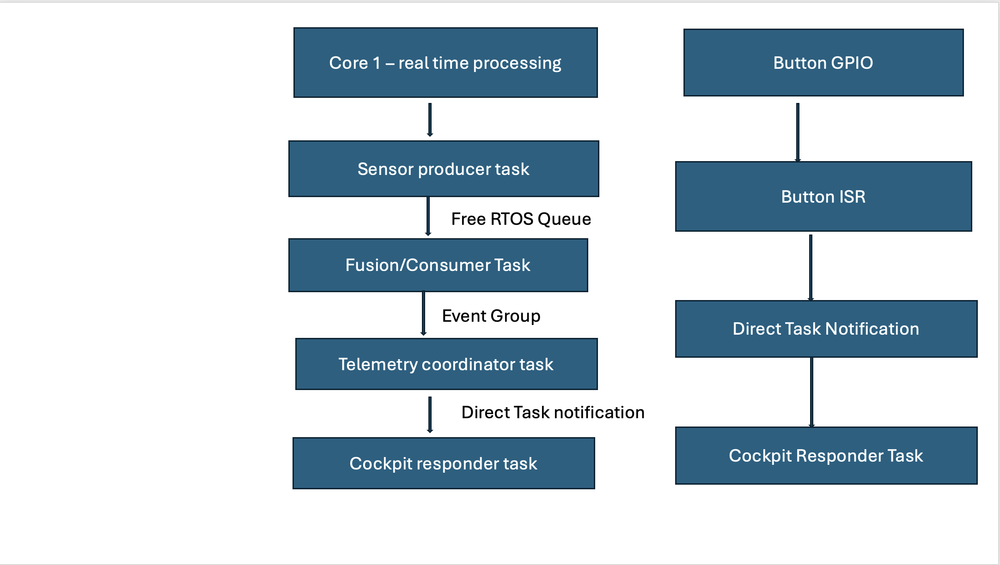

# Real-Time Systems Final Capstone — Avionics Monitoring and Fault-Tolerant Telemetry System

## One Sentence
A dual-core FreeRTOS avionics monitoring and telemetry system that demonstrates deterministic inter-task communication, real-time scheduling, and fault-tolerant operation using industry-standard IPC mechanisms.

---

## Demo
- **Video:** <Insert YouTube or screen recording link here>
- **Live Wokwi:** ZAVERI-FINAL-RTS26Summer

---

## Architecture

This project simulates an avionics telemetry pipeline running on an ESP32 using FreeRTOS. A producer task periodically samples simulated flight sensor data and sends it through a queue to a fusion/consumer task, which processes the data and signals the coordinator using an Event Group. The coordinator then notifies the cockpit task using a Direct Task Notification to indicate that a new telemetry frame is available. A serial monitor running on Core 0 continuously reports queue depth, heartbeat counters, event bits, and WCET measurements while the processing pipeline executes on Core 1.

---

## Tasks & Timing (WCET Evidence)

| Task | Period T | WCET C | U = C/T | Priority | Deadline |
|------|---------:|--------:|---------:|---------:|---------:|
| Sensor Producer | 50 ms | 5.141 ms | 0.103 | High | 50 ms |
| Fusion / Consumer | 50 ms | 11.310 ms | 0.226 | Medium | 50 ms |
| Comms / Log Monitor | 1000 ms | 50.509 ms | 0.051 | Low | 1000 ms |

**Total Utilization (U):** **0.380**

**Schedulability Result:**  
The total processor utilization remains below the three-task Rate Monotonic scheduling bound (0.780), demonstrating that the task set is schedulable under both Rate Monotonic (RM) and Earliest Deadline First (EDF) scheduling assumptions.

---

## Hazard Analysis & Standard Mapping

| Hazard | Potential Effect | Mitigation | Standard |
|--------|------------------|------------|----------|
| Sensor data loss | Incorrect aircraft telemetry | Queue buffers communication between producer and consumer tasks | RTCA DO-178C |
| Queue overflow | Lost telemetry frame | Queue depth monitored continuously through the monitor task | RTCA DO-178C |
| Producer task failure | Missing sensor updates | Heartbeat counters detect stalled producer execution | RTCA DO-178C |
| Consumer processing delay | Stale flight information | WCET analysis verifies task timing requirements | RTCA DO-178C |
| Missed cockpit notification | Delayed pilot awareness | Direct Task Notification provides deterministic signaling | RTCA DO-178C |

**Standard Mapping**

This project demonstrates software engineering practices commonly used in safety-critical avionics systems following the principles of **RTCA DO-178C**. The design emphasizes deterministic task scheduling, bounded inter-task communication, timing verification through WCET analysis, heartbeat monitoring, and graceful degradation. This project is intended as an educational demonstration and is not a certified avionics implementation.

---

## Graceful Degradation

The telemetry system is designed to continue operating safely even when faults occur. If telemetry frames are delayed or dropped because of queue congestion, the event is detected through queue monitoring and heartbeat counters. Rather than stopping the system, the pipeline continues processing subsequent sensor updates while logging the fault to the monitor. This prevents a single communication failure from causing complete system failure and maintains continuous telemetry operation.

---

## Build & Run

**Platform**
- ESP32-S3
- ESP-IDF v5.x
- FreeRTOS
- Wokwi Simulator

**Toolchain**
- ESP-IDF
- Visual Studio Code
- Wokwi Online Simulator

### Steps
1. Open the project in ESP-IDF or Wokwi.
2. Build the project.
3. Flash or start the simulation.
4. Observe the serial monitor for:
   - Producer telemetry
   - Fusion processing
   - Event Group synchronization
   - Direct Task Notifications
   - Queue monitoring
   - Heartbeat counters
   - WCET measurements

---

## Tailored For

**Target Role:** Aerospace / Defense Embedded Systems Engineer

This project demonstrates practical experience with real-time embedded software concepts that are directly applicable to aerospace and defense industries. The use of deterministic scheduling, FreeRTOS IPC primitives, WCET analysis, fault monitoring, and dual-core task partitioning reflects the types of software architecture commonly used in avionics, flight control, and mission-critical embedded systems. The project showcases both software engineering fundamentals and safety-oriented design practices expected in modern embedded aerospace applications.
